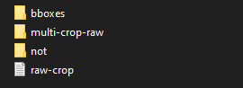
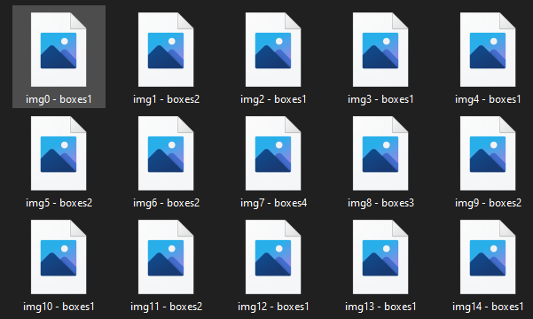
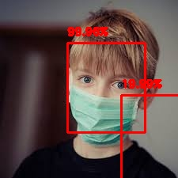
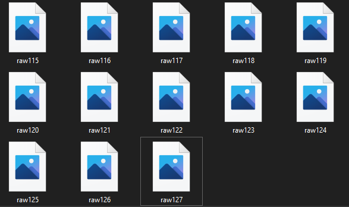
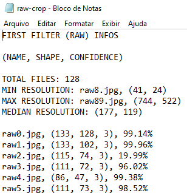
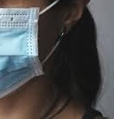
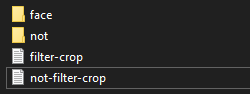
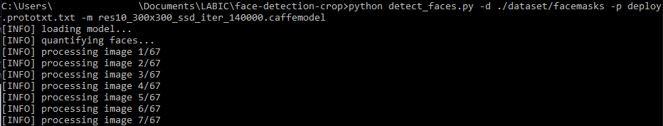
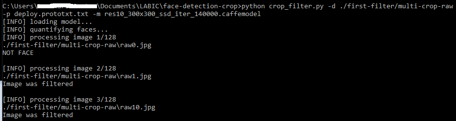

# Face Extractor

O programa tem como objetivo receber um dataset com imagens de pessoas e extrair apenas as potenciais faces contidas em cada imagem. Para realizar a detecção, uma rede Caffe ***res10_300x300_ssd_iter_140000.caffemodel*** pré treinada é utilizada, junto com seu modelo ***deploy.prototxt*** (Para maiores informaçoes sobre a rede pré treinada, veja a sessão [Referencias](#Referencias). Após fazer a detecção dos rostos em cada imagem (1° filtragem), o programa os recorta e envia para uma pasta determinada pelo usuário.

Quando o processo for finalizado, a rede é utilizada novamente (2° filtragem) para verificar se os recortes realmente são faces, e eliminar os falsos positivos. Além disso, ao final de cada etapa, um arquivo .txt é gerado contendo informaçoes sobre as imagens como seu nome, tamanho e probabilidade de ser um rosto.

## Sumário

- [Primeira filtragem (raw)](#primeira-filtragem-(raw))
- [Segunda filtragem](#segunda-filtragem)
- [Como executar o programa](#como-executar-o-programa)
	- [1° filtragem: Detecção das faces e recorte](#1°-filtragem:-detecção-das-faces-e-recorte)
	- [2° filtragem: Classificação das imagens recortadas](#2°-filtragem:-classificação-das-imagens-recortadas)
	- [Resultados](#resultados)
- [Referencias](#referencias)

## Primeira filtragem (raw)

Nessa etapa, o programa ```detect_faces.py``` passa por cada imagem do dataset e faz a primeira detecção das n-faces de cada uma e, baseando-se nas coordenadas de cada bounding box, efetua os n-recortes na imagem e os envia para uma pasta determinada, que por padrão é ```./first-filter/multi-crop-raw```. 

Vale ressaltar que aumentei o tamanho do bounding box para o recorte abrenger o rosto por completo. Confira em **detect_faces.py, linha 90**: 

```python
startX, startY, endX, endY = startX - 2, startY - 10, endX + 2, endY + 10
``` 

O programa também salva uma cópia de cada imagem original com os bounding boxes **desenhados**, assim da pra ter um resultado mais "visual" das detecções da rede. Por padrão a pasta de destino é  ```./first-filter/bboxes```

É importante salientar que nesta etapa, o limiar da probabilidade de ser um rosto, confidence, deve ser baixo, logo tudo que possui uma probabilidade acima do valor do confidence será interpretado como rosto (útil para imagens com varias pessoas ou com qualidade baixa). Portanto, a rede irá detectar o máximo possível de faces da imagem, independente do tamanho e luminosidade.

A pasta ```./first-filter``` por padrão contém todas as informaçoes uteis da primeira filtragem. Sua estrutura interna é a seguinte:

<p align="center">
  
</p>

A pasta ```./first-filter/bboxes``` contem todas as imagens em que ao menos um rosto foi encontrado, com o bounding box desenhado em cada "rosto" da imagem, junto com o confidence. Nessa pasta, fica claro como falsos positivos são frequentes na primeira filtragem. Abaixo é mostrado como são salvos os arquivos da pasta e um exemplo dos bounding boxes desenhados.

<p align="center">
   
</p> 

Bounding boxes desenhados:

<p align="center">
   
</p> 

A pasta ```./first-filter/multi-crop-raw``` contém efetivamente todos os recortes dos mesmos bounding boxes mostrados na pasta **bboxes**

<p align="center">
  
</p> 

Exemplo de rosto recortado:

<p align="center">
   
</p> 

A pasta ```./first-filter/not``` contém imagens que nenhum rosto foi detectado, é util ter essa pasta pois podemos verificar se existem falsos negativos e realoca-los.

O arquivo .txt gerado possui o total de recortes (possiveis faces), a imagem com maior e menor resolução e a média das resoluçoes de todas as imagens. Ele também mostra qual o tamanho e a probabilidade daquela imagem ser um rosto.

<p align="center">
   
</p> 

## Segunda filtragem 

Como na primeira filtragem o confidence foi baixo, praticamente todos os rostos foram encontrados, entretando isso causa um problema: muitos falsos positivos são selecionados (imagens que não eram um rosto mas a rede detectou como sendo um). Abaixo um exemplo de um falso positivo recortado na primeira fase:

<p align="center">
   
</p> 

Porém, nessa fase, como as imagens (recortes das originais) estão isoladas, o programa consegue destinguir com maior facilidade se é um rosto ou não, e separa as imagens selecinadas e não selecionadas em suas devidas pastas, além de gerar um arquivo .txt como na primeira filtragem. O arquivo python utilizado é o ```crop_filter.py```

A pasta padrão que contem as imagens da segunda filtragem é ```./filtered-crop``` e sua estrutura é a seguinte:

<p align="center">
   
</p> 

A pasta ```./filtered-crop/face``` contém todos os recortes que foram classificados como rosto na segunda filtragem, já a pasta ```./filtered-crop/not``` os recortes em que um rosto não foi encontrado.

Os arquivos .txt possuem informaçoes sobre os recortes dos rostos e dos sem rosto.

## Como executar o programa

Como dito acima, o programa possui duas etapas: 1° e 2° filtragem.

### 1° filtragem: Detecção das faces e recorte

Primeiro você deve abrir um terminal (Windows, Linux ou Mac) e rodar o script **detect_faces.py** junto com os argumentos necessários:

* **-d ou --dataset:** caminho para a ***pasta original*** contendo todas as imagens
* **-p ou --prototxt:** arquivo ***deploy.prototxt***
* **-m ou --model:** modelo Caffe ***res10_300x300_ssd_iter_140000.caffemodel***

E os argumentos **opcionais** (pastas onde as imagens serão salvas e confidece), que ja possuem um valor pré determinado mas que pode ser alterado pelo usuário:

* **-b ou --bbox_folder:** caminho para a pasta onde as ***imagens com bouding box*** desenhdos serão salvas. 		- Padrão: ```./first-filter/bboxes```

* **-r ou --multi_crop_folder:** caminho para pasta onde ***todos os recortes*** do 1º filtro serão salvos.     	- Padrão: ```./first-filter/multi-crop-raw```

* **-nt ou --not_face_folder:** caminho para pasta onde as ***imagens sem rosto detectado*** no 1º filtro serão salvas. 
	- Padrão: ```./first-filter/not```

* **-txt ou --txt_path:** caminho para a pasta onde o ***arquivo .txt*** será salvo. 
	- Padrão: ```./first-filter/raw-crop.txt```

* **-c ou --confidence:** valor minimo do ***confidence*** (limiar). 
	- Padrão para 1º filtro: 0.15 (15%)

Os caminhos pré definidos de pastas estão configurados no inicio do código python e **podem ser alterados manualmente**, dessa forma os argumentos opcionais não precisam ser informados no terminal.

Após informar os argumentos, inicie o programa e seu terminal vai parecer com algo assim:
OBS.: No exemplo abaixo, utilizei os caminhos de pasta pré definidos.

<p align="center">
   
</p> 

Aguarde o processo ser finalizado e veja que as imagens e o arquivo .txt foram salvos nas pastas pré definidas (ou em outra que escolheu).

### 2° filtragem: Classificação das imagens recortadas

Abra um segundo terminal (ou se preferir, utilize o primeiro) e execute o script **crop_filter.py** junto com os argumentos necessários:

* **-d ou --dataset:** caminho para a ***pasta original*** contendo todas as imagens
OBS.: É de extrema importancia que o caminho especificado para este dataset seja o mesmo caminho onde as imagens recortadas no primeiro filtro foram salvas, no caso se você utilizou a pasta padrao, o argumento deve ser:

```./first-filter/multi-crop-raw```

* **-p ou --prototxt:** arquivo ***deploy.prototxt***
* **-m ou --model:** modelo Caffe ***res10_300x300_ssd_iter_140000.caffemodel***

E os argumentos **opcionais** (pastas onde as imagens serão salvas e confidece), que ja possuem um valor pré determinado mas que pode ser alterado pelo usuário:

* **-ff ou --filtered_crop_face:** caminho para a pasta onde as ***imagens com bouding box*** desenhdos serão salvas. 		
	- Padrão: ```./filtered-crop/face```

* **-nff ou --filtered_crop_not:** caminho para pasta onde ***todos os recortes*** do 1º filtro serão salvos.     	
	- Padrão: ```./filtered-crop/not```

* **-ftxt ou --filtered_txt:** caminho para pasta onde as ***imagens sem rosto detectado*** no 1º filtro serão salvas. 
	- Padrão: ```./filtered-crop/filter-crop.txt```

* **-ntxt ou --not_filtered_txt:** caminho para a pasta onde o ***arquivo .txt*** será salvo. 
	- Padrão: ```./filtered-crop/not-filter-crop.txt```

* **-c ou --confidence:** valor minimo do ***confidence*** (limiar). 
	- Padrão para 2º filtro: 0.9 (90%)

Após informar os argumentos, inicie o programa e seu terminal vai parecer com algo assim:
OBS.: No exemplo abaixo, utilizei os caminhos de pasta pré definidos.

<p align="center">
   
</p> 

Aguarde o processo ser finalizado e veja que as imagens e o arquivo .txt foram salvos nas pastas pré definidas (ou em outra que escolheu).

### Resultados

Na pasta escolhida para salvar as imagens com rosto detectado (por padrao: **/filtered-crop/face**) você vai encontrar o resultado final do projeto, com imagens recortadas de faces, indepentende de possuirem mascara ou não. Após esse processo, você pode fazer um resize nas imagens baseando-se na média informada no arquivo txt.

É importante dizer que os valores de confidence/threshold são empíricos e dependendo do dataset, devem ser modificados. Porém, é essencial que na primeira filtragem, o confidence deve ser menor para garantir que as faces serão encontradas, já na segunda filtragem, com as imagens 'isoladas', deve ser maior. No pior dos casos, ao utilizar esse padrão, ao final do processo na pasta ***./filtered-crop/face*** vão exitir apenas recortes de rostos (devido ao alto valor de confidence), e na pasta ***/filtered-crop/not*** vão existir alguns falsos negativos. Se a quantidade de falsos negativos for relevante para o dataset, cabe ao usuário realocar essas imagens.

Dai que se torna útil o uso dos arquivos txt, pois da pra conferir o confidence de cada imagem, fazendo uma analise mais direcionada para as imagens com **maior confidence** que foram classificadas como **não** sendo um rosto (possibilidade de falso negativo), e nas imagens com **menor confidence** que foram ditas como **sendo** um rosto (possibilidade de falso positivo).

## Referencias

Para fazer a **detecção de faces**, utilizei como referencia o post do blog [PyImageSearch](https://www.pyimagesearch.com/), que explica detalhadamente como utilizar a rede neural Caffe, com maior aprofundamento apenas na **detecção** dos rostos. Além disso, utilizei partes do código mostrado para me auxiliar nos processos aqui descritos. Acesse: 

* https://www.pyimagesearch.com/2018/02/26/face-detection-with-opencv-and-deep-learning/